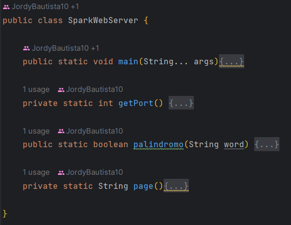
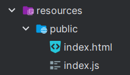
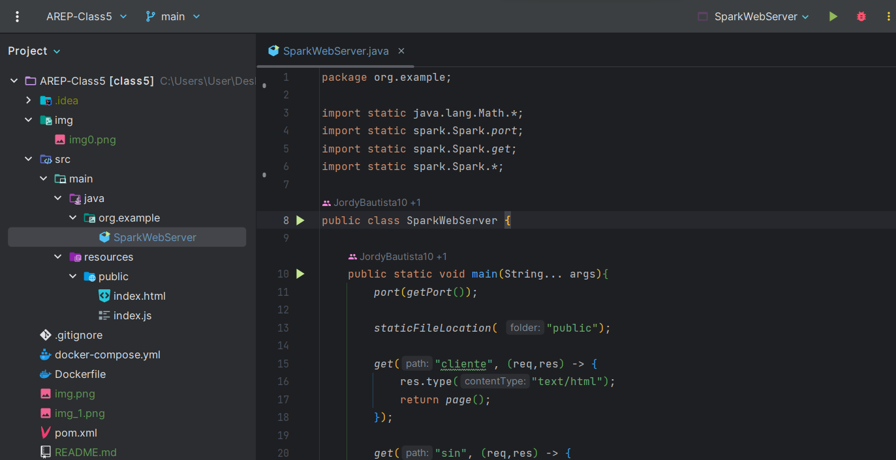
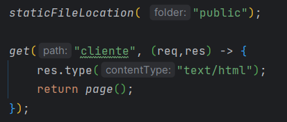
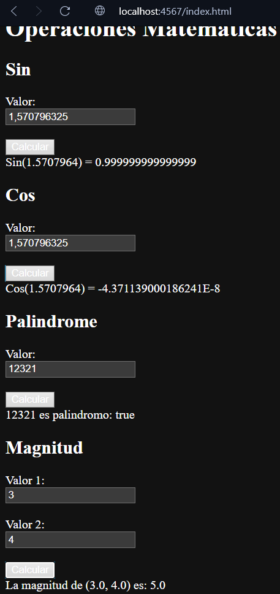
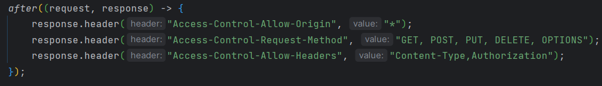
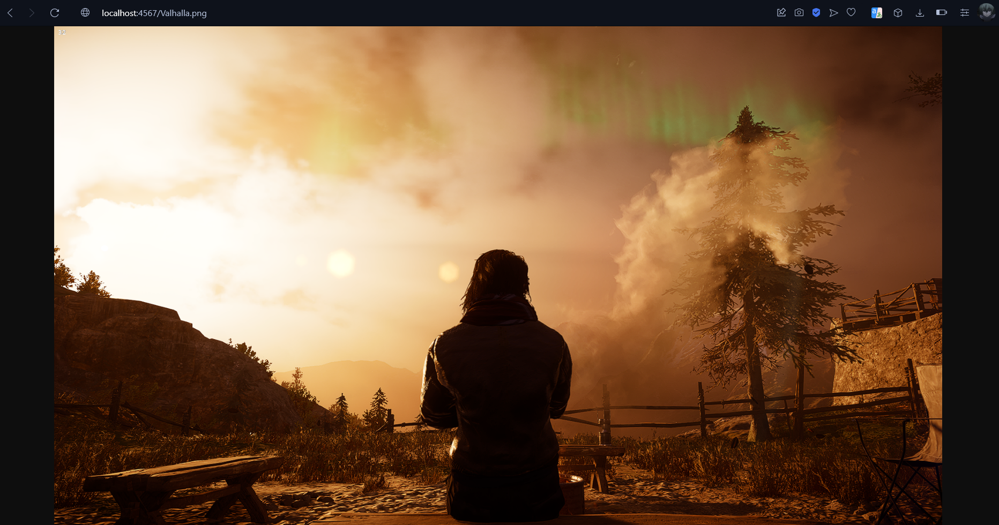
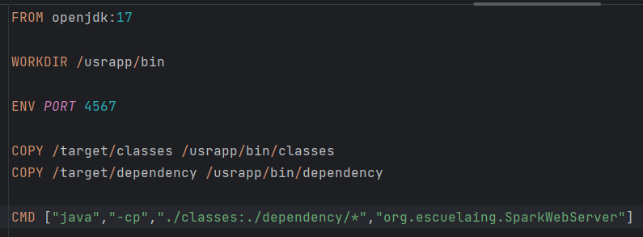
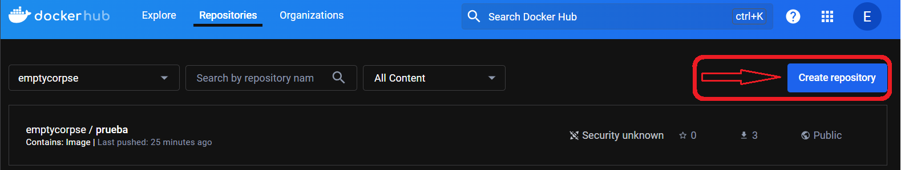
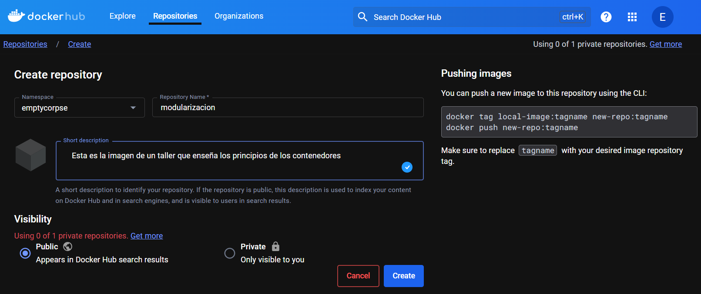

# TALLER 5: TALLER DE DE MODULARIZACIÓN CON VIRTUALIZACIÓN E INTRODUCCIÓN A DOCKER

Este taller se realizó con la finalidad de explorar y familiarizarse con el uso del framework Spark creando un API sencilla, que expone varios servicios, los cuales al recibir unos parámetros en la URL realizan una operación, estos servicios son:
- Sen: Recibe un número en radianes y devuelve la operación seno aplicada a este.
- Cos: De forma similar al anterior, con la diferencia que este servicio devuelve la operación de coseno.
- Palíndroma: Recibe una cadena de texto y devuelve si es o no una palabra palíndroma, es decir, que se lee igual de derecha a izquierda y viceversa.
- Magnitud: Recibe los dos valores que componen un vector en 2D y retorna la magnitud de este vector, es decir, la raíz de la suma de los valores al cuadrado.

Además, también se realizó para aprender una herramienta de contenedores (docker), tanto su funcionamiento, configuración y utilidad dentro de la industria. El repositorio con la imagen correspondiente de este proyecto es `emptycorpse/modularizacion`

### Prerequisitos

Para que el código corra de forma satisfactoria y se puedan seguir todos los pasos se necesitara de: Java, Maven, Git y Docker; sin embargo,  para la descarga e instalación de estos elementos, adjunto los link de material de apoyo de otros autores

* [Tutorial instalación Java] (https://youtu.be/4WKo13f2Qpc?si=lHG84Jp_k7YbBFmp)
* [Tutorial instalación Git] (https://youtu.be/jpTrSSjPlEo?si=VdcaXSaNEFkR3hCk)
* [Tutorial instalación Maven] (https://youtu.be/biBOXvSNaXg?si=wfySIfBTUERGEVZC)
* [Tutorial instalación Docker] (https://youtu.be/_et7H0EQ8fY)

## Construido con:

* [Java](http://www.dropwizard.io/1.0.2/docs/) - Lenguaje con el cual funciona la mayor parte del proyecto
* [Html](https://developer.mozilla.org/es/docs/Web/HTML) - Usado para la sección del cliente
* [JavaScript](https://developer.mozilla.org/es/docs/Web/JavaScript) - Este lenguaje le permite al cliente realizar las peticiones necesarias
* [Maven](https://maven.apache.org/) - Usado para la construcción de la estructura del proyecto
* [Git](https://git-scm.com) - Usado para el versionamiento
* [Docker](https://www.docker.com/products/docker-desktop/) - Es un software que permite crear imagenes y correr contenedores
* [Spark](https://mvnrepository.com/artifact/org.apache.spark/spark-core) - Framework con el cual se realizó el API

## Diseño

Este proyecto cuenta con una sola clase, la cual realiza todo el trabajo de asignar el puerto para la aplicación, levantar el API, configurar sus endpoints y definir sus comportamientos, también los comportamientos más elaborados se dejaron en un método aparte o se implementó por medio de una librería:

Similar al funcionamiento de Springboot y con el fin de leer archivos estáticos, se creó la siguiente carpeta donde se alojan todos los archivos de este tipo del proyecto, como lo es la página web junto con un js que contiene la lógica:

## Para Comenzar

#### Repositorio

En primera instancia, debemos obtener el código del proyecto, por lo que se ejecutara el comando desde consola. (tenga en cuenta que debe estar en la carpeta deseada antes de clonar el repositorio)

~~~
https://github.com/JordyBautista10/AREP-Class5.git
~~~

Posteriormente, descargamos las dependencias necesarias y compilamos el código

~~~
mvn clean install compile
~~~

#### Ejecución

Para correr este codigo usando un ID, hay que ingresar a la carpeta que se muestra a continuación y ejecutar el archivo llamado SparkWebServer.java

#### Pruebas

Una vez se ejecuta el proyecto dirijase al browser de su preferencia y coloque la siguiente dirección URL en el navegador, he indique el archivo que desea consultar, puede ser cualquiera que este en la carpeta public:

~~~
http://localhost:4567/[Archivo a consultar]
~~~

En este caso colocaremos http://localhost:4567/index.html, o tambien solamente consultando el endpoint /cliente.

Como podemos observar esta es la encargada de retornar los archivos que se encuentren en disco sin importar la extension que este archivo tenga.

### Arquitectura
#### main
Es el método el cual configura cuáles serán los endpoints, qué elementos van a recibir en la query y que va a retornar cada petición.

#### getPort
Este método configura el puerto que va a  usar la aplicación

#### palindromo
Este método retorna si la palabra de entrada es palíndroma, es decir, que se lee de la misma forma en ambos sentidos

#### page
Este método retorna la página del cliente, esto se realizó como prueba de lo que podía hacer la petición y si estas podrían devolver ste tipo de contenido; sin embargo, esta función fue remplazada por: `staticFileLocation( "public")`

### Uso del framework para desarrollador
Si se quiere añadir un nuevo endpoint para configurar un comportamiento distinto, se debe acceder a la clase SparkWebServer y una vez adentro, en el método main, debe añadir una nueva función lambda con el nombre de la petición y dentro, configurar el comportamiento y la salida:

Si quiere añadir un nuevo archivo html, js, css e incluso imagenes, deberá añadirlo a la carpeta public. Para este ejemplo se añadio una imagen con nombre "Valhalla.png", de forma que si se sonsulta esta imagen se obtiene:

### Uso de Docker

Primero se crea un archivo con el nombre `Dockerfile`, el cual va a contener la configuración de la imagen. En la siguiente imagen se puede ver la configuración de este archivo para el proyecto actual, el cual define la versión de jdk que usará, crea una carpeta, configura el puerto, copia los archivos de las clases compiladas y sus dependencias a la carpeta creada y finalmente ejecuta el proyecto

Una vez se tiene el `Dockerfile` se puede usar el siguiente comando para crear la imagen(debe tener docker ejecutandose y ya haber compilado):
~~~
docker build --tag emptycorpse/modularizacion .
~~~
Ahora, hay que crear un repositorio de DockerHub para alojar esta imagen, siga los siguientes pasos:

Asigenele un nombre de tal forma que quede igual al de la imagen, en este caso la imagen se llama `emptycorpse/modularizacion`

Finalmente, ya que se tiene la imagen y el repositorio, con el siguiente comando la imagen se subira al repositorio(debe tener la sesion iniciada en la aplicacion de escritorio):
~~~
docker push emptycorpse/modularizacion
~~~
Si descarga esta imagen, deberá correrla con el siguiente comando(todos los links dentro de este archivo deben seguir funcionando):
~~~
docker run -d -p 46000:4567 --name modularizacion emptycorpse/modularizacion
~~~
## Versioning

Para el versionamiento se usó [Git](https://git-scm.com). Si necesita volver en alguna versión del código, visite los commits.

## Autor

* **Jordy Santiago Bautista Sepulveda** 
